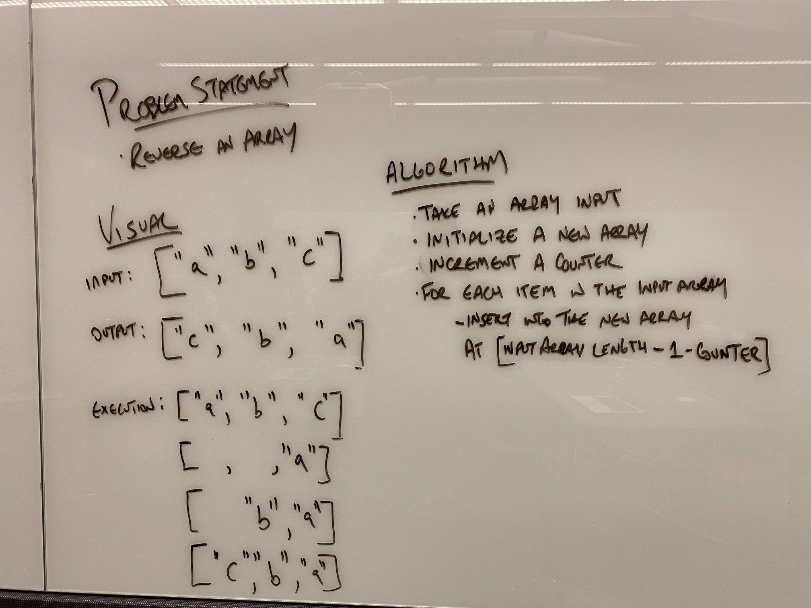

# Reverse an Array
This was the first code challenge of 401.

## Challenge
Take a string array as input and return an array with the strings in reverse array index positions.

## Approach & Efficiency
The approach I took was to create a new array and calculate new positions for each item using the length of the first array and a counter 

## Solution

